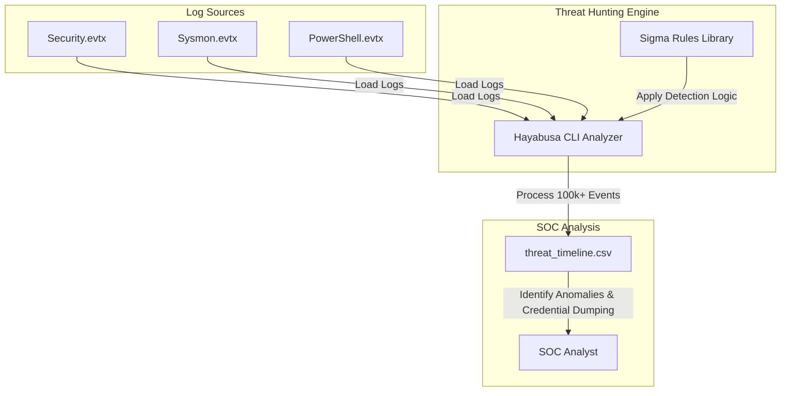

# Lab 09: Running a SOC and Hunting for Threats

## Aim
To perform fast, offline threat hunting on Windows Event Logs (EVTX) using Sigma rules to uncover advanced attackers and behavioral anomalies that evade standard automated SOC alerts.

---

## Architecture Diagram



---

## Tools Required
* **Hayabusa (CLI):** A timeline generator and threat hunting tool designed for rapid forensic analysis of Windows event logs.
* **Sigma Rules:** A generic, open signature format allowing defenders to describe relevant log events in a standardized way.
* **Sample EVTX Logs:** Raw Windows Event Logs containing mock malicious activity for analysis.

---

## Execution Steps

### 1. Log Preparation
1. Download mock malicious Windows Event Logs (e.g., `Security.evtx`, `Sysmon.evtx`, `PowerShell Operational`) into a local directory named `evtx_samples/`.

### 2. Execute Hayabusa Hunt
1. Open a command prompt and execute Hayabusa against the log directory to generate a consolidated CSV timeline:
   ```cmd
   hayabusa-windows-amd64.exe csv-timeline -d ./evtx_samples/ -o threat_timeline.csv
   ```
2. Note the console output detailing the number of events processed, rules applied, and severity of the matches found.

### 3. Timeline Analysis
1. Open the resulting `threat_timeline.csv` in a spreadsheet editor.
2. Filter by `high` and `crit` levels to locate specific indicators of compromise.
3. Identify the timestamps and command-line details for the Suspicious PowerShell EncodedCommand and the LSASS Credential Dumping activities.

---

## Screenshots

### 1. Hayabusa Execution and Summary


### 2. CSV Threat Timeline Analysis
*(Student: Insert a screenshot here of your spreadsheet application showing the parsed timeline and highlighting the detected malicious events)*


---

## Result
* Successfully deployed Hayabusa to conduct rapid, offline threat hunting across raw Windows Event Logs.
* Applied standardized Sigma rules to successfully identify behavioral anomalies, specifically uncovering PowerShell evasion tactics and LSASS memory access used for credential dumping.
